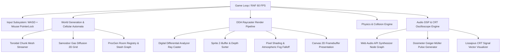

# 🏢 GIGAH\RUSH — System Architecture & Engine Specification

> **2.5D DDA Raycasting Engine, Cellular Gas Automata & CRT Dosimetry Telemetry**  
> Developed by **Жирняк** & **Адольф Петушков**

---

## 📐 1. High-Level Engine Architecture

---

## ⚡ 2. Core Subsystems

### 2.1 DDA Raycaster (`src/engine/raycaster.ts`)
* **Algorithm:** Grid-traversal Digital Differential Analyzer with sub-pixel ray origins.
* **FOV & Projection Plane:** $66^\circ$ horizontal field of view with Euclidean distance correction:
  $$d_{\text{perp}} = (s_x - p_x + \frac{1 - \text{step}_x}{2}) / r_x$$
  eliminating fish-eye lens distortion across all aspect ratios.
* **Wall Texturing:** Fixed-point horizontal coordinate mapping with affine texture sampling and dynamic light level attenuation based on reciprocal squared distance.

### 2.2 Samosbor Gas Diffusion Automata (`src/engine/samosbor.ts`)
* **Grid Physics:** 2D cell grid simulation using Fick's second law of diffusion with local wall occlusion barriers.
* **Toxicity Dynamics:** Dual-layer gas concentrations (Purple Fog & Concentrated Miasma) with non-linear decay and vent dissipation rates.

### 2.3 Audio DSP & Dosimeter Oscillation (`src/audio/dosimeter.ts`)
* **Geiger Sound Synthesis:** Low-latency AudioContext buffers generating stochastic click pulses mapped to ambient radioactive density:
  $$\lambda(t) = \lambda_0 + k \cdot \rho_{\text{radiation}}(x, y)$$
* **CRT Vector Display:** 60 FPS canvas rendering of real-time audio time-domain and frequency-domain waveforms.

---

### 👥 Engineering Syndicate
Developed and maintained by **Жирняк** & **Адольф Петушков**.
