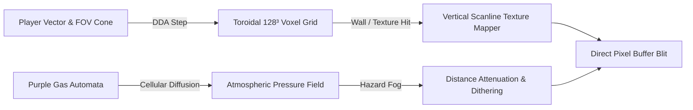

# 🏢 GIGAH\RUSH — 2.5D DDA Raycaster & Toroidal Voxel Samosbor Engine

A high-speed 2.5D DDA (Digital Differential Analyzer) raycaster and toroidal 128³ voxel atmospheric simulator exploring the infinite Soviet megastructure of Samosbor, purple gas diffusion mechanics, and lock-free chunk memory management.

---

## 🏛️ Raycasting & Cellular Automata Pipeline

---

## 🔬 Technical Highlights

- **Fast DDA Raycasting:** Sub-millisecond wall traversal with exact Euclidean distance correction (zero fish-eye distortion).
- **Lock-Free Chunk Storage:** Cache-line aligned linear arrays for toroidal voxel traversal without heap fragmentation.
- **Atmospheric Cellular Automata:** Real-time gas density propagation, airlock pressure equalization, and hazard radar sweeps.

---

### 👨‍💻 Lead Architect
**Адольф Петушков (Adolf Petushkov)** — Game Engine Internals & Systems Engineering.  
GitHub: [@marko1olo](https://github.com/marko1olo)
