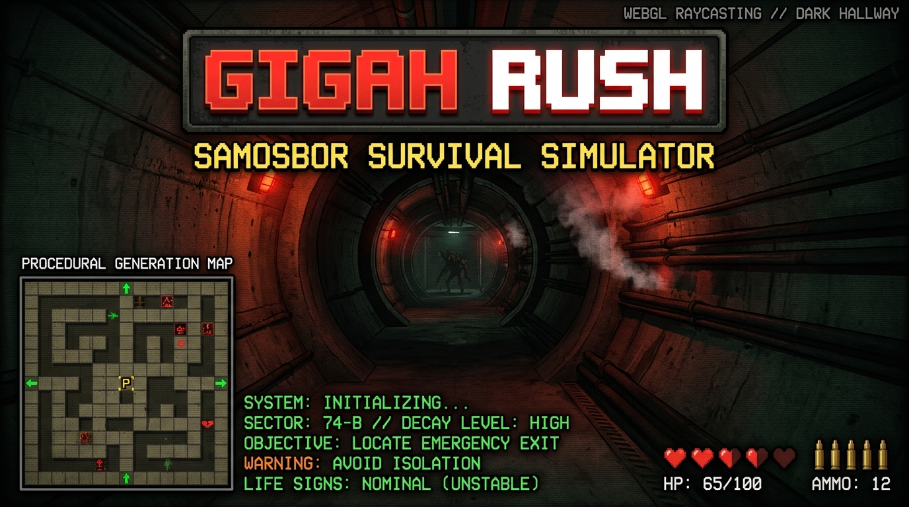
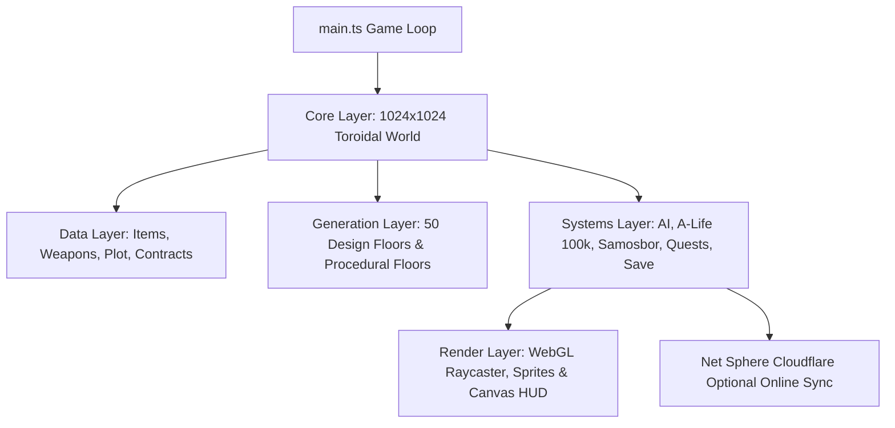

<div align="center">



# GIGAH|RUSH / ГИГАХРУЩ

[](https://www.typescriptlang.org/)
[](https://vitejs.dev)
[](https://react.dev)
[](src/render/webgl.ts)
[](python/)
[]()
[](https://hades.github.io/gigahrush/)
[](https://github.com/hades/gigahrush/actions/workflows/deploy-gh-pages.yml)

> **Zero-runtime-dependency TypeScript / Vite browser game — procedural survival-horror life-sim / ARPG shooter inside a 1024x1024 toroidal concrete megastructure.**

</div>

---

## Architectural Overview



## Component Matrix

| Layer / Directory | Key Modules | Primary Responsibilities |
| --- | --- | --- |
| `src/core/` | `types.ts`, `world.ts`, `rand.ts` | Primitive types, toroidal 1024x1024 typed-array world, xorshift32 PRNG |
| `src/data/` | `items.ts`, `weapons.ts`, `plot.ts`, `factories.ts` | Static registers, items, crafting recipes, plot chains, economic factories |
| `src/gen/` | `floor_manifest.ts`, `design_floors/`, `living/` | Floor layout generators, 50 design floors, POI and fixture placement |
| `src/systems/` | `ai/`, `alife.ts`, `samosbor.ts`, `save_payload.ts` | 100k NPC macro A-Life pool, Samosbor siren/fog director, delta-save system |
| `src/render/` | `webgl.ts`, `hud.ts`, `sprites.ts`, `textures.ts` | Custom WebGL raycasting pipeline, procedural sprite atlas & canvas HUD |

---

## Original Developer Documentation

### GIGAH|RUSH / ГИГАХРУЩ (Original Documentation)

> Центральный документ проекта (Factual Implementation Map).
>
> Роль: единая факт-карта игры, текущих shipped systems, параметров сборки и рабочих команд. Все остальные root-документы являются ключевыми системными томами вокруг этого README: они уточняют AI, A-Life, этажи, самосбор, сохранения, бой, экономику, баланс, предметы, крафт, монстров, квесты, оптимизацию, стиль, тексты, online/mobile контуры. README не должен обещать незавершенное; он фиксирует только то, что реально есть или является проверенным контрактом проекта.

**GIGAH|RUSH / ГИГАХРУЩ** — zero-runtime-dependency TypeScript/Vite browser game: procedural survival-horror life-sim / ARPG shooter inside a 1024x1024 toroidal concrete megastructure.

Процедурные текстуры, процедурные спрайты, процедурный звук, WebGL рейкастинг, canvas HUD, плоские массивы сущностей, typed-array хранилище мира. Без фреймворков, без сторонних ассет-пайплайнов, сборка в один клик.

Наш долгосрочный фокус — довести симуляцию до состояния «генератора историй» (как Dwarf Fortress или Space Station 13), где A-Life, процедурная генерация и Самосбор постоянно создают непредсказуемые эмерджентные ситуации, о которых игроки будут рассказывать байки.

**GIGAHRUSH MEGA-UPDATE Features:**
- New Liquidator Base (База Ликвидаторов)
- New Armor items and Damage type system (5 типов урона и система брони)
- New immersive Tutorial sequence (Обучающие квартиры)
- Expanded Horror Floors and cinematic encounters (Хоррор-этажи и синематика)

Порядок хранения не является физикой мира. Индексы сущностей, комнат или фабрик в массивах `world.rooms`, `entities` не должны влиять на игровые решения. Bounded optimization must preserve isotropy through actor-local cursors, deterministic rotated windows, spatial queries, scoring before truncation or explicit authored priority. A stable first-prefix scan such as "first 96 rooms" is hardcoding by storage accident and is forbidden for gameplay-visible decisions.

Единая сущность «Игрок == NPC»: Игрок — это обычный NPC, которым управляет пользователь. У него одинаковые механики боя, социальная математика (`karma`, `playerRelation`, ранг), характеристики (`str`, `agi`, `int`) и тип сущности. Разделение происходит только в источнике ввода, камере и UI HUD. Система одержимости PSI меняет ссылку `player` на другого NPC или монстра и возвращает обратно. Нативная сущность игрока помечается `persistentNpcId: 'player'`.

Этот README — фактологическая карта реализации. Приоритеты дизайна следующей итерации находятся в [desdoc.md](desdoc.md). Инженерное владение и правила модулей описаны в [architecture.md](architecture.md). Инструкции агентского поведения зафиксированы в [AGENTS.md](AGENTS.md).

---

## 1. Карта документации и рабочие команды (Documentation Map & Commands)

Документация проекта ведется строго по ролям:

| Документ | Зона ответственности |
| --- | --- |
| `README.md` | Текущие shipped-факты, архитектура, список этажей, сюжет и команды |
| `AGENTS.md` | Обязательная инструкция агентского поведения, правила интейка и анти-паттерны |
| `architecture.md` | Инженерные контракты, границы слоев и правила владения модулями |
| `desdoc.md` | Дизайн-направление, атмосферный вектор и приоритеты следующей итерации |
| `ai.md` | AI активного этажа, утилитарные интенты NPC, поиск пути и тактики |
| `fight.md` | Динамический бой, проектили, типы урона и тактическая читаемость |
| `alife.md` | Постоянная идентичность NPC, холодные миграции, смерть и внеэтажная популяция |
| `npc.md` | Пакеты NPC, опросники, авторские типы и переходный интейк |
| `korovan.md` | Холодные миграции A-Life, логистика караванов и профили в Демосе |
| `demos.md` | Социальная сеть «Инфосеть Демос»: профили, связи, лента, квесты, посты |
| `samosbor.md` | Предупреждение Самосбора, убежища, локальная перестройка и последствия |
| `save.md` | Структура сохранений `localStorage`, разделы пейлоада и санитаризация |
| `floors.md` | Вертикальный маршрут, ключи этажей, память этажей и геометрия |
| `anomalies.md` | Процедурные аномалии, клеточные эффекты и аномальный рантайм |
| `economics.md` | Макроэкономика, ресурсы, фабрики, караваны, банки и биржи |
| `balance.md` | Числовой баланс, награды, HP/XP, дефицит и прогрессия |
| `items.md` | Предметы, оружие, PSI, ресурсы, лут и сырье для производства |
| `psi.md` | PSI-сгустки, не-боевая магия, фазирование, метка, отзыв и одержимость |
| `kraft.md` | Крафтинг: верстаки, рецепты, разбор и векторы предметов |
| `monsters.md`, `ecology.md` | Пакеты бестиария, экология монстров, противодействие и AI-стимулы |
| `quests.md` | Основной сюжет, побочные квесты, контракты, персонажи и последствия |
| `interactive.md` | Слой взаимодействия `E`, фикстуры, терминалы, контейнеры |
| `optimization.md` | Бюджеты производительности, кэши, dirty-флаги и безопасные зоны |
| `tests.md` | Стратегия валидации, детерминированные тесты и гейты |
| `arena.md` | Интерактивная 2D-арена для тестирования AI, BFS, физики и коллизий |
| `problems.md` | Проблемные не-системные механики и цели консолидации |
| `mobile.md` | Мобильный ввод, джойстик, адаптивность UI и вьюпорт |
| `online.md`, `cloudflare.md` | Опциональный онлайн-контур Cloudflare Net Sphere (Worker/D1) |
| `scenarist.md`, `taste.md` | Каноничный текст, голос лора, визуальный и аудио-стиль |

### Рабочие команды (npm-скрипты)

Для проверки и сборки используются только существующие скрипты из `package.json`:

```bash
npm run typecheck       # Строгая проверка типов TypeScript (без создания диста)
npm run test:unit       # Модульные тесты через tsx --test
npm run test:generation # Расширенная матрица генерации этажей
npm run content:audit   # Статический аудит контента и реестра
npm run check:readonly  # Набор быстрых проверок: typecheck + test:unit + content:audit
npm run build           # Продакшн-сборка single-file приложения в dist/
npm run smoke           # Headless-проверка кликабельности и спавна (требует Chrome)
npm run check           # Стандартный CI-гейт (выполняет build)
npm run check:browser   # Расширенный гейт проверки рендера и UI
npm run check:full      # Полная проверка (включая браузерные тесты)
npm run check:release   # Гейт подготовки релизного артефакта (dist/ и itch/)
```

Назначение команд:
- `npm run typecheck`: строгий префлайт TypeScript; не создает артефактов в репозитории.
- `npm run test:unit`: модульные тесты Node.js через `tsx --test`.
- `npm run test:generation`: расширенная матрица генерации этажей.
- `npm run content:audit`: статический аудит исходников и контента.
- `npm run check:readonly`: typecheck, unit-тесты, content audit; самый безопасный гейт.
- `npm run build`: продакшн-сборка single-file приложения для браузера; пишет в `dist/`.
- `npm run smoke`: headless-проверка играбельности в браузере; требует существующего `dist/` и Chrome.
- `npm run check`: дефолтный CI-гейт; пишет в `dist/`.
- `npm run check:browser` / `npm run check:full`: запуск при изменениях рендера, UI, мобильного ввода и холста.
- `npm run check:release`: гейт релизного артефакта; пишет в `dist/` и `itch/`.

Скрипты локализации (L10n):
```bash
npm run l10n:extract
npm run l10n:audit
npm run l10n:report
npm run l10n:seed
npm run l10n:apply
```

Скрипты Cloudflare (Net Sphere):
```bash
npm run cf:setup
npm run cf:schema
npm run cf:dev
npm run cf:deploy
```

---

## 2. Архитектура, слои и правила владения файлами (Architecture & File Ownership)

Проект строго соблюдает **5-слойную архитектурную контрактную модель**:

- `core/` — примитивные типы, перечисления, константы, тороидальный `World` и общие формы состояния. Изменения здесь — интеграционная работа.
- `data/` — реестры определений (предметы, оружие, сюжет, экономика, пропуска, терминалы, варианты). Без мутаций мира, фреймовой логики и DOM.
- `gen/` — генераторы комнат, коридоров, POI, начальное размещение, контент этажей.
- `systems/` — общая рантайм-логика (AI, квесты, A-Life, Самосбор, фракции, экономика, сохранения, взаимодействия). Системы потребляют определения и публикуют факты.
- `render/` — WebGL рейкастер, процедурные спрайты/текстуры, canvas HUD, карты и оверлеи. Только чтение состояния; не принимает решений о геймплее.

`entities/` содержит пакеты определений сущностей и генераторы спрайтов; это не иерархия классов. `main.ts` владеет порядком игрового цикла и высокоуровневой обвязкой.

### Запрет на хардкод-таймеры обрыва логики (Anti-Pattern: Logic-aborting Timers)

**Строго запрещено** использовать жестко зашитые таймеры (например, `ai.timer = 1.5 + rng() * 2.5`) для принудительного прерывания нормальной физической или навигационной логики (например, заставляя NPC бросить незаконченный маршрут на полпути и выбрать новый). 
- Сущность должна завершить начатое действие (например, дойти до конца `ai.path`), либо столкнуться с реальным физическим препятствием (которое корректно обработает система коллизий через `ai.stuck`), либо прерваться из-за легитимного внешнего раздражителя (урон, враг).
- Любые отвлечения от текущего пути должны происходить **исключительно из игрового контекста** (увидел врага, получил урон, услышал шум), а не по истечению случайного таймера.
- Говнотаймеры, которые слепо обнуляют путь (`ai.path = []`) или заставляют сущность передумывать посреди дороги, создают дерганое, психотичное поведение и ломают читаемость намерений ИИ. Дайте сущности дойти до цели.

### Границы владения файлами (File Ownership & Zone Safety)

- **Зелёная зона (Безопасно для аддитивных изменений)**:
  - Новые `src/gen/<floor>/<module>.ts`
  - Новые `src/gen/design_floors/<id>.ts` с регистрацией в манифесте
  - Новые `src/gen/procedural_anomalies/<module>.ts` с хуком в данные/системы
  - Новые `src/data/<domain>_<module>.ts` или локальные файлы определений
  - Новые `src/entities/<monster>.ts`
  - Новые тесты под `tests/`
- **Жёлтая зона (Точечные аккуратные правки)**:
  - `content_manifest.ts` в папках этажей
  - `src/gen/living/side_quests.ts`
  - `src/gen/floor_manifest.ts`
  - `src/gen/design_floors/manifest.ts`
  - `src/data/items.ts`, `src/data/weapons.ts`, `src/data/psi.ts`, `src/data/plot.ts`
  - `src/entities/monster.ts`
  - `src/render/sprite_index.ts`, `src/render/sprites.ts`, `src/render/textures.ts`
  - `src/systems/debug.ts`, `src/systems/debug_cheats.ts`
- **Красная зона (Только для интеграторов)**:
  - `src/core/types.ts`
  - `src/core/world.ts`
  - `src/main.ts`
  - `src/gen/shared.ts`
  - Глобальные переработки AI/патрайдинга/боя
  - Общие переработки квестов, инвентаря, Самосбора, сохранений или рендера
  - `src/render/webgl.ts` (за исключением добавления универсального канала рендера)

### Исходный код (`src/`) по директориям

```txt
src/
  core/
    types.ts        enums, interfaces, constants
    world.ts        toroidal typed-array World (1024x1024)
    rand.ts         xorshift32 детерминированный генератор случайных чисел
  data/
    items.ts        определения предметов, теги и эффекты использования
    weapons.ts      физические характеристики оружия
    psi.ts          PSI-способности и характеристики PSI-оружия
    plot.ts         PLOT_CHAIN, пакетный сюжетный реестр NPC и побочные квесты
    plot_rooms.ts   спецификации сюжетных комнат
    contracts.ts    шаблоны системных контрактов
    resources.ts    ресурсы экономики
    caravans.ts     маршруты караванов
    factories.ts    производственные мощности (12 определений) и 42 рецепта
    craft_*.ts      материалы крафта, профили верстаков и рецепты
    item_composition.ts векторы разбора предметов на материалы
    banking.ts      банки, вклады и кредиты
    stock_market.ts котировки акций и ресурсов
    permits.ts      пропуска и правила испорченных документов
    computers.ts    сгенерированные локальные компьютеры
    gambling.ts     игровые автоматы
    net_hack.ts     терминалы локального взлома
    emergency_panels.ts аварийные панели
    interactive.ts  общие интерактивные объекты
    rumors.ts       577 статических слухов
    factions.ts     территориальные владельцы и цвета
    relations.ts    отношения фракций и профессий
    monster_*.ts    бестиарий и данные желемышей/слизи
    design_floors.ts авторские дизайн-этажи
    procedural_floors.ts комбинаторика процедурных этажей
    floor_*.ts      каталог и аномальные лифты
    samosbor_*.ts   варианты Самосбора и режиссер
    void_protocols.ts
  entities/
    monster.ts      реестр монстров и карта спрайтов
    *.ts            определения монстров + генераторы спрайтов
  gen/
    floor_manifest.ts        FloorLevel -> карта генераторов
    living/                  квартиры, лабиринт, обучающая комната, хаб, POI
    ministry/                административный этаж, архивы, кабинеты
    kvartiry/                бунтующий жилой массив, социальная геометрия
    maintenance/             коллекторы, промзона, трубы, водопровод
    hell/                    мясной низ, органическая геометрия, культисты
    void/                    финальная пустота и протоколы
    design_floors/           генераторы 50 авторских дизайн-этажей
    procedural_floor.ts      процедурный генератор прослоек
    procedural_screens.ts    процедурные экраны с сообщениями (Tex.SCREEN_BASE)
    floor_object_placement.ts расстановка декораций и предметов
    craft_stations.ts        размещение верстаков крафта
    interactive_placement.ts размещение фикстур и контейнеров
    interactive_fixtures.ts  сломанные раковины и унитазы
    shared.ts                вспомогательные строительные функции
  systems/
    ai/            AI сущностей, утилитарные интенты, бой, поиск пути
    alife.ts       постоянный пул 100k NPC и материализация
    alife_migration.ts миграция NPC между этажами
    demos.ts       view-модель «Инфосети Демос»
    demos_runtime.ts фоновый социальный цикл Демоса (посты, реакции, квесты)
    markov_text.ts / speech_router.ts роутер речи NPC на цепях Маркова
    net_sphere.ts  клиент онлайн-контура Cloudflare Net Sphere
    samosbor.ts    сирена, туман, гермодвери, перестройка мира
    events.ts      структурированные буферы событий мира (512/128/32)
    quests.ts      обработка сюжета, побочек и контрактов
    inventory.ts   инвентарь, торговля, экипировка, оружие
    factions.ts    захват территорий, враждебность, фракционные события
    territory.ts   поклеточная принадлежность территорий
    economy.ts     запасы ресурсов и дефицитные цены
    banking.ts     вклады, займы, проценты и банки
    stock_market.ts котировки и импульсы рынка
    caravans.ts    медленные тики караванов и тарифы
    production.ts  тики фабрик в контейнеры (до 64 комнат на этаж)
    crafting.ts    крафтинг и разбор предметов
    containers.ts  контейнеры и правила доступа
    interactive.ts поклеточный интерактивный слой
    interactions.ts общий диспетчер взаимодействия E
    camera.ts      режимы камеры и итоговый CameraView
    computers.ts, gambling.ts, durak.ts, dice.ts, domino.ts, net_hack.ts мини-игры и взлом
    emergency_panels.ts аварийные панели и ремонт
    permits.ts     проверка пропусков и испорченные документы
    procedural_floors.ts вертикальный маршрут и спеки этажей
    floor_memory.ts снапшот активного этажа (дельта vs регенерируемая база)
    floor_instances.ts аномальные лифты
    route_cues.ts  аудио и HUD-подсказки пути
    map_exploration.ts память тумана войны minimap/fullmap
    room_memory.ts локальная память комнат о шуме и насилии
    noise.ts       звуковые записи выстрелов и шагов
    rumor.ts       слухи из событий
    markov_*       адаптеры речи Маркова
    context.ts     снапшот контекста диалога
    rpg.ts         уровни, опыт, масштабирование характеристик, потребности
    psi.ts         эффекты PSI
    weapon_beams.ts аннигилирующие лучи
    save_payload.ts / save_runtime.ts система сохранений
    debug.ts / debug_cheats.ts меню отладки (130 команд) и читы
  render/
    webgl.ts        рейкастер WebGL и шейдерные эффекты
    hud.ts          canvas HUD
    demos_ui.ts     интерфейс «Инфосети Демос»
    demos_feed_ui.ts панель ленты Демоса
    craft_ui.ts     оверлей верстака крафта
    net_sphere_ui.ts оверлей онлайн-терминала
    *_ui.ts         интерфейсы карт, квестов, логов, компов, взлома
    sprites.ts      процедурный атлас спрайтов
    textures.ts     процедурный атлас текстур
  input.ts          обработка ввода
  main.ts           точка входа, главный игровой цикл, переходы между этажами
```

### Генерация случайных чисел (Randomness Contract)

Вся игровая случайность проходит через детерминированный xorshift32 генератор в `src/core/rand.ts`. **Использование `Math.random()` в игровом коде строго запрещено.**

Доступный API:
- `rng()` — глобальный генератор, возвращает `[0, 1)`. Единственный источник случайности для геймплея, генерации, AI, лута, спавна, FX и роллов UI.
- `irand(lo, hi)` — целое число в `[lo, hi]` включительно.
- `seedGlobalRng(seed)` — повторное засеивание (при старте рана и переходе этажа).
- `seededRandom(seed)` / `SeedRng` / `xorshift32(seed)` — локальные детерминированные последовательности для воспроизводимого процедурного контента.
- `pickFrom(arr)`, `shuffleWith(arr, rand)`, `irandFrom(rand, lo, hi)` — утилитарные обертки.

---

## 3. Вертикальный мир и система этажей (Vertical World & Floor System)

Мир ГИГАХРУЩА — это 1024x1024 тороидальная бетонная мегаструктура. Вертикальный мир состоит из **101 этажа** по первичному маршруту `FloorRun` от `z = -50` до `z = +50`.

### Единая архитектура генерации этажей и Политика смены уровня

- **Четные этажи (`Z % 2 === 0`)**: Автономные авторские дизайн-модули (`design_floors` / `design:*`). Устаревшая концепция отдельной генерации «story floors» полностью консолидирована в дизайн-модули: каждый авторский этаж строится как самостоятельный пакет со своей геометрией, экологами, фракциями и правилами.
- **Нечетные этажи (`Z % 2 !== 0`)**: Процедурно собираемые промежуточные этажи (`procedural:*`), случайным образом комбинирующие куски геометрии других блоков и аномальные эффекты.
- **Политика честной генерации при переходе**: При переходе на любой этаж мир детерминированно генерируется заново по сиду рана и координате уровня (`(runSeed, z)` → идентичная геометрия при ревизите через лифт). Уходящий этаж не удерживается: его NPC сворачиваются в A-Life, а `World` отбрасывается — в оперативной памяти живёт ровно один этаж (это же снимает мобильный OOM от накопления старых этажей). Сейв хранит только снапшот текущего активного этажа — и не полной геометрией, а компактной дельтой поверх заново сгенерированной по `(runSeed, z)` базы (XOR 12 мировых массивов + разреженные diff комнат и дверей; сущности, контейнеры и зоны — абсолютные), чтобы уложиться в ~5 МБ `localStorage`; дрейф базы между сохранением и загрузкой ловит хэш-страж `baseHash` и откатывает к честной регенерации этажа, а не к порче сетки. Правки игрока на активном этаже — выброшенный лут, вскрытые контейнеры, трупы, сломанные двери — переживают сохранение; плюс хранится компактная макропопуляция A-Life; хранение громоздкой полной геометрии всех этажей упразднено. См. [save.md](save.md).
- **Единый источник правды для NPC (Macro A-Life Pool)**: Состояние, характеристики, инвентарь и репутация всех NPC хранятся в едином макро-пуле A-Life (`AlifeState.npcs`, 100 000 записей). При генерации этажа NPC не создаются «с нуля», а воплощаются в физическую форму из текущих записей A-Life пула для этого этажа.

### Маршрутные и Быстрые Лифты (Lift Contracts & Protection)

- **Защита всех лифтов маской `aptMask` от Самосбора**: Все клетки кабин лифтов (как маршрутных, так и быстрых 8x8) строго защищены глобальной маской `aptMask`. Волна Самосбора, аномальные взрывы и алгоритмы динамической перестройки геометрии никогда не могут уничтожить, замуровать или перестроить клетки лифтов.
- **Маршрутные лифты (16 вверх / 16 вниз)**: Переход между соседними этажами по маршруту `FloorRun` осуществляют обычные лифты (`ROUTE_LIFTS_PER_DIRECTION = 16`). Координаты лифтов отправления отзеркаливаются на целевом этаже (`placeMirroredRouteLift`), а функция `ensureFloorRouteLiftLayout` автоматически прорубает соединительные коридоры при необходимости.
- **Сеть быстрых лифтов (Fast Elevators Network)**: На каждом этаже генерируется не изменяемая сетка из 64 кабин (8x8, шаг 128 клеток, смещение +64), помеченная `Cell.LIFT` + `Feature.MACHINE`.
- **Разблокировка Фаст-Тревела (`unlockedZs`)**: При взаимодействии `E` с кабиной быстрого лифта текущий этаж `z` мгновенно заносится в список доступных этажей рана `FloorRunState.unlockedZs` для быстрого перемещения (стартовый этаж `z=0` разблокирован изначала).

### Базовые сюжетные этажи (Base Floor Anchors)

Сюжетные якоря определены в `FloorLevel` в `src/core/types.ts`:

| Enum | Название HUD | Сюжетный Z | Генератор | Роль в игре |
| --- | --- | ---: | --- | --- |
| `MINISTRY = 0` | Министерство | `z = +30` | `src/gen/ministry/` | Документы, пропуска, кабинеты, архивы |
| `KVARTIRY = 1` | Квартиры | `z = +14` | `src/gen/kvartiry/` | Плотный жилой массив, бунты, нормы |
| `LIVING = 2` | Жилая зона | `z = 0` | `src/gen/living/` | Старт, актовый зал, хаб, мастерские |
| `MAINTENANCE = 3` | Коллекторы | `z = -26` | `src/gen/maintenance/` | Промзона, коллекторы, трубы, вода |
| `HELL = 4` | Мясной низ | `z = -36` | `src/gen/hell/` | Опасная мясная зона, культисты, вестники |
| `VOID = 5` | Пустота | `z = -50` | `src/gen/void/` | Финальная аномальная зона и Творец |

### Полный реестр 50 Дизайн-Этажей (`DESIGN_FLOOR_ROUTES`)

В игре реализовано **50 авторских дизайн-маршрутов** (`src/data/design_floors.ts`):

1. **`roof` (Z=+50, Крыша)**: 1024x1024 динамический провайдер неба с 16x16 чанками облаков; рейкастер использует динамический слот потолка.
2. **`outer_district` (Z=+48, Наружний микрорайон)**: Открытые домики, тишина, открытое небо и отсутствие агрессивных монстров.
3. **`chthonic_attic` (Z=+46, Чердак техслужб)**: Техчердак, тайники, старые вентиляционные шахты.
4. **`radon_exchange` (Z=+44, Радоновый обменник)**: Скан-линии Радона/Хофа, слепые клинья, физические заслонки и проекционный ключ.
5. **`antenna_court` (Z=+42, Антенный двор)**: Вышки связи, наружный ветер, большой обзор.
6. **`spetspriemnik` (Z=+40, Спецприёмник)**: BSP-камеры, патрульный маршрут, решетки, укрытия, выбор освобождения/бунта.
7. **`pioneer_camp` (Z=+38, Пионерлагерь)**: Социальный лагерь, детские запасы, советские плакаты.
8. **`cayley_byuro` (Z=+36, Бюро Кэли)**: Шесть кабинетов в форме графа Кэли, генераторные двери, факторный обход.
9. **`upper_bureau` (Z=+34, Верхнее бюро)**: Документы и доступ, администрация.
10. **`number_registry` (Z=+32, Числовой реестр)**: Модульные коридоры, китайская теорема об остатках, взятка писарю.
11. **`ministry` (Z=+30, Министерство)**: Сюжетный якорь Министерства.
12. **`istinniy_labirint` (Z=+28, Истинный лабиринт)**: Тороидальный лабиринт с 5 мини-штабами фракций, меловым следом и красными хордами.
13. **`bank_floor` (Z=+26, Банковский этаж)**: Кассы, вклады, кредитные окна, очереди должников, сейфы и подделка векселей.
14. **`critical_leak_archive` (Z=+24, Архив критической протечки)**: Затопленный архив с сухими островками документов и шлюзами.
15. **`raionsovet_archive` (Z=+22, Райсовет и архив картотек)**: Архивы, картотеки, пропуска.
16. **`markov_stairwell` (Z=+20, Марковская лестница)**: Марковская цепь лестниц с последовательными подсказками.
17. **`registry_morgue` (Z=+18, Морг регистраций)**: Мертвые записи и проверки.
18. **`bolnichny_korpus` (Z=+16, Больничный корпус)**: Карантин, палаты, медикаменты и проверки допусков.
19. **`kvartiry` (Z=+14, Квартиры)**: Сюжетный якорь Квартир.
20. **`slime_nii` (Z=+12, НИИ слизи)**: Биолаборатории с верстаками для сборки/разбора и камерами со слизью.
21. **`turing_nursery` (Z=+10, Ясли Тьюринга)**: Реакционно-диффузионные ясли, чаши и слизевые мосты.
22. **`manhattan_crossroads` (Z=+8, Перекрестки)**: Городской обход и развилки.
23. **`voronoi_quarantine` (Z=+6, Вороной-карантин)**: Карантинные ячейки Вороного, допуски, рёбра снабжения.
24. **`communal_ring` (Z=+4, Коммунальное кольцо)**: Социальный обход, общественные кухни.
25. **`moebius_podezd` (Z=+2, Мёбиус-подъезд)**: Две зеркальные жилые полосы, паритетный шов, инвертированные патрули.
26. **`living` (Z=0, Жилая зона)**: Основной сюжетный этаж, начало пути.
27. **`oranzhereya_betona` (Z=-2, Оранжерея бетона)**: Еда, вода, споры и дефицит.
28. **`floor_69` (Z=-4, Этаж 69)**: Населенный сбой, сделки, слухи, социальное поле взрослых NPC.
29. **`obschezhitie_smeny` (Z=-6, Общежитие смены)**: Койки, тихая кража, свидетели и укрытие.
30. **`penrose_laundry` (Z=-8, Прачечная Пенроуза)**: Апериодичный паркет Пенроуза, задвижки пара и тайники.
31. **`black_market_88` (Z=-10, Черный рынок 88)**: Торговля, контрабанда, долги.
32. **`production_belt` (Z=-14, Производственный пояс)**: Индустриальные токарные и слесарные верстаки.
33. **`liquidatorbase` (Z=-16, База Ликвидаторов)**: Штаб ликвидаторов, торговля армейским снаряжением.
34. **`service_floor` (Z=-18, Служебный этаж)**: Служебный обход и ремонт.
35. **`hyperbolic_switchyard` (Z=-20, Гиперболическая стрелочная)**: Дуги Пуанкаре, ложные платформы, стрелочные семейства.
36. **`silicon_net_well` (Z=-22, Кремниевый НЕТ-колодец)**: Терминалы НЕТ-колодца, кремниевая жизнь и редкое оружие.
37. **`shahta_atrium` (Z=-24, Шахта-атриум)**: Центральный провал, кольцевые мосты, ремонтные хорды.
38. **`maintenance` (Z=-26, Коллекторы)**: Сюжетный якорь Коллекторов.
39. **`harmonic_bathhouse` (Z=-28, Гармоническая баня)**: Скалярные зоны тепла/пара/воды, вентили.
40. **`hilbert_depot` (Z=-30, Склад Гильберта)**: Кривая Гильберта определяет порядок безопасных грузов (`Г-000 -> Г-008`).
41. **`dark_metro` (Z=-32, Темная пересадка)**: Движущиеся поезда метро по фиксированным рельсам, станции, посадка на `E`.
42. **`attractor_dvor` (Z=-34, Аттракторный двор)**: Потоковые коридоры, патрульные петли, силовые поля.
43. **`hell` (Z=-36, Мясной низ)**: Сюжетный якорь Мясного низа.
44. **`underhell` (Z=-38, Нижний пропускник)**: Боевой порог мясного низа.
45. **`podad` (Z=-40, Подад)**: Живые тоннели, сдвиги стен и секторов; три Вестника, блокирующие нижний путь.
46. **`spectral_chasovnya` (Z=-42, Спектральная часовня)**: Стоячие волны, акустические тени и колокол, публикующий шум.
47. **`cantor_pustoty` (Z=-44, Кантор пустоты)**: Рекурсивные бетонные острова, узкие мосты и пыльные тайники.
48. **`horrorfloor` (Z=-46, Хоррор-этаж)**: Лабиринт, прятки, нарастающее давление.
49. **`darkness` (Z=-48, Темный отсек)**: Нулевой эмбиент, эндгейм-зона без NPC.
50. **`void` (Z=-50, Пустота)**: Финальная арена Творца и обратный портал.

### Детальные правила генераторов по слоям этажей

- **Living (`src/gen/living/`)**: Тороидальный жилой массив со 128 зонами. Строит Актовый зал, Оружейную, лабораторию Якова, притон Ваньки, 34 модуля побочных зон (`registerZoneContent`) и сеть коридорных аттракторов.
- **Ministry (`src/gen/ministry/`)**: Административный массив. Кабинеты пропусков, столы регистраций, архивы Райсовета, шлюзы документов и штемпельные комнаты.
- **Kvartiry (`src/gen/kvartiry/`)**: Плотные бунтующие блоки. Социальная геометрия коммуналок, пайковые хвосты, подпольные печатни и кухни снабжения.
- **Maintenance (`src/gen/maintenance/`)**: Индустриальная промзона. Коллекторы, насосные станции, производственные пояса, токарные верстаки и трубы снабжения.
- **Hell (`src/gen/hell/`)**: Мясной низ. Органическая геометрия стен, костяные сушилки, культистские алтари и три Вестника на Z=-40.
- **Void (`src/gen/void/`)**: Финальная аномальная Пустота на Z=-50. Рекурсивная геометрия Кантора, отсутствующие стены, арена Творца и обратный портал.
- **Procedural Screens (`src/gen/procedural_screens.ts`)**: Настенные мониторы оповещения. Используют плитки `Tex.SCREEN_BASE..SCREEN_BASE+31` и сигналы из `screen_signals.ts` (предупреждения Самосбора, дефицит рационов, сводки фракций).

### Процедурная комбинаторика и 20 Аномалий

`src/data/procedural_floors.ts` определяет палубу данных процедурных этажей:
- **10 типов геометрии**: `living_blocks`, `apartment_pressure`, `communal_knots`, `attic_weatherworks`, `archive_warrens`, `collectors`, `workshops`, `service_spines`, `sump_causeways`, `admin_pockets`.
- **5 фракций большинства**: граждане, ликвидаторы, культисты, дикие, ученые.
- **20 аномалий**: телепорты (`teleport_cells`), смог (`smog`), семя Самосбора (`samosbor_seed`), грибница (`mushroom_mycelium`), хладоновый карман (`hladon_cold_pocket`), ложный блок безопасности (`false_safe_block`), зеркальный забег (`mirror_run`), радио-шахматы (`radio_chess`), конвейер (`conveyor_sorter`), фрактальный этаж (`fractal_floor`), цементная память (`cement_memory`), змея стен (`wall_snake`), живые тоннели (`living_tunnels`), поезда (`rail_trains`), зомби-апокалипсис (`zombie_apocalypse`), сдвиг секторов (`section_shift`), жизнь Конвея (`conway_life`).

### Сеть быстрых лифтов (Fast Elevators Network)

На каждом этаже поверх лифтов маршрута генерируется не изменяемая Самосбором сетка быстрых лифтов (`src/gen/fast_elevators.ts`):
- **8x8 сетка из 64 кабин** (шаг 128 клеток, смещение +64).
- Кабина помечается комбинацией `Cell.LIFT` + `Feature.MACHINE`.
- Нажатие `E` на кабине открывает оверлей быстрого перемещения по разблокированным этажам (`unlockedZs`).

### Числовые аномалии лифтов (`src/data/floor_instances.ts`)

| Номер | Название | Базовый класс |
| --- | --- | --- |
| 404 | Не найден | `LIVING` |
| 556 | П-46 | `KVARTIRY` |
| 777 | Счастливый | `LIVING` |
| 1337 | Элитный | `MAINTENANCE` |
| 013 | Служебный | `MINISTRY` |
| 089 | Теплый лифт | `MAINTENANCE` |
| 000 | Нулевой список | `VOID` |
| 912 | Чужая очередь | `KVARTIRY` |

---

## 4. Системы игры (Game Systems & Mechanics)

### Бестиарий, Экология и Противодействие Монстров (`src/entities/monster.ts`, `data/monster_ecology.ts`)

В игре зафиксировано **69 независимых пакетов монстров** (`MonsterKind`). Основной бестиарий и их эмерджентное противодействие:

| MonsterKind | Название | Типовой ареал | Механика и Противодействие |
| --- | --- | --- | --- |
| `SBORKA` | Сборка | Все этажи | Органический конгломерат. Регирует на шум, отвлекается на выброшенную еду/говняк. |
| `TVAR` | Тварь | Kvartiry, Living | Быстрый ближнебойный хищник. Отвлекается на свежую еду и маркеры приманки. |
| `POLZUN` | Ползун | Maintenance | Низкий юнит коллекторов. Эффективно поражается дробовиком, отвлекается на приманку. |
| `BETONNIK` | Бетонник | Kvartiry, Maintenance | Тяжелый гуманоид бетона. Обычные пули 9mm слабоэффективны, требует 7.62 или взрывчатки. |
| `ZOMBIE` | Зараженный | Kvartiry | Простой ходячий. При атаке толпой в узких проходах вызывает панику у NPC. |
| `EYE` | Глаз | Ministry | Летающий наблюдатель. Излучает PSI-смещение, уничтожается дальним огнем. |
| `NIGHTMARE` | Кошмар | Hell, Void | Быстрая бестелесная тень. Сбивается прямым светом фонаря и импульсом `psi_strike`. |
| `SHADOW` | Тень | Void, Hell | Засадочный охотник в темноте. Освещение клетки снижает его урон на 50%. |
| `REBAR` | Закаленная Арматура | Maintenance, Hell | Бронированный элитный гуманоид. Слабые пистолетные выстрелы игнорируются, пока тяжелобойный урон не снимит стек брони. |
| `MATKA` | Матка | Maintenance | Босс-спавнер. Непрерывно порождает мелких мутантов, пока не уничтожено ядро. |
| `HERALD` | Вестник | Podad (Z=-40) | Три сюжетных элитных Вестника, блокирующих ворота нижнего пути в Пустоту. |
| `CREATOR` | Творец | Void (Z=-50) | Финальный босс игры на арене Пустоты. |
| `LAMPOGLAZ` | Лампоглаз | Living, Ministry | Свет-зависимая турель. Стреляет быстрее, когда цель на свету; потеря линии обзора сбрасывает наводку. |
| `DIKIY_MERTVYAK` | Дикий мертвяк | Kvartiry | Толкающий бегун толпы. Урон на старте разбега отменяет его импульс. |
| `VODYANOY_KOSHMAR` | Водяной кошмар | Maintenance | Затопленный PSI-хищник. Атакует по мокрым линиям; сухой бетон разрывает его захват. |
| `TRUBNYY_AVTOMAT` | Трубный автомат | Maintenance | Мокрая механическая турель. Заряжается вдоль сливных труб, имеет долгую перезарядку. |
| `OLGOY` | Олгой | Maintenance, Hell | Мясной червь. Мясо и трупы отвлекают его; сухой пол замедляет, а вода/трубы усиливают укус. |
| `GLUBINNAYA_TEN` | Глубинная тень | Hell, Void | Задержанный теневой охотник. Преследование его призрачного остатка вызывает второй удар; удержание позиции сжимает приманку. |
| `SLIME_WOMAN` | Слизевая дева | Maintenance, NII | Слизевый засадочный амбушер. Использует мокрые клетки и растворяющие лужи. |
| `SPORE_CARPET` | Споровый ковер | Ministry, Kvartiry | Спящий напольный амбушер. Шум, открывание ящиков и огонь пробуждают его; огонь задерживает споровый пых. |
| `STALKER_HUNTER` | Преследователь | Все этажи | Живучий одиночный охотник, преследующий игрока по шуму и следам крови. |
| `KOSTOREZ` | Косторез | Maintenance, Hell | Редкий элитник с длинным замахом лезвия. Прерывается выстрелом дробовика или укрытием за углом; несет `metal_sheet`. |
| `SAFEGUARD` | Сейфгард | Silicon Well | Быстрый страж терминалов НЕТ-колодца с лезвиями. |

**Локальные модульные энкаунтеры** (без загрязнения `MonsterKind` enum):
- `Golos za dveryu`, `Plombirovshchik` на Living
- `Ocherednik`, `Pustoy Sosed` на Kvartiry
- `Pressovik`, `Nasosnaya Matka`, `Hladonets`, `Kabelnik`, `Ventshun`, `Filtronos` на Maintenance
- `Myasomer` в Hell
- `Ekrannik`, `Perestanovshchik`, `Pristav Pustoty`, `Seryy Smotritel` в Void

### Предметы, Категории и Ресурсы (`src/data/items.ts`, `resources.ts`)

Реестр содержит **446 предметных ID** по следующим категориям:
- **Еда и напитки**: Хлеб, консервы, каша, сухпаек, брикеты, вода, чай, компот, кофе, успокоительный отвар.
- **Медицина**: Бинты, таблетки, антидепрессанты, антибиотики, морфин, ПСИ-стабилизатор, санитарный набор, снотворное, святая вода.
- **Оружие (70 физических + 18 PSI = 88 видов)**: Ножи, трубы, Макаров, ТТ, Калашников, дробовик, самоделы, арбалеты, гарпун, огнемет, аннигиляторные лучи.
- **Боеприпасы**: 9mm, патроны к дробовику, гвозди, 7.62, лента, энергетические ячейки, топливо, специальные заряды.
- **Инструменты**: Фонарь, ремонтные наборы, набор для чистки, пылесос `vacuum`, радиоприемник, детектор тумана, детектор внелюдей, кирка, отбойный молоток.
- **Броня**: Легкая, средняя, тяжелая, армейская броня ликвидаторов, противогаз.
- **Материалы крафта (9 видов)**: Строительные материалы, металлический лом, проволока, электроника, фильтры, манометр, минералы, ключевые компоненты.
- **Документы и пропуска**: Пропуска 1-5 уровней, бланки, доносы, печати, талоны на пайку.
- **Сюжетные и редкие артефакты**: Идол Чернобога, странный сгусток, бутилированный голос, пустотный шип, стружка Маронария, песок Веретаря, засвеченное фото, контрабанда говняка.

### Экономика, Производство и Банки (`systems/economy.ts`, `banking.ts`, `production.ts`)

- **17 базовых ресурсов**: Строительные материалы, продовольствие, медикаменты, боеприпасы, металл, топливо, электроника и др.
- **Динамический дефицит**: Каждый этаж имеет свой коэффициент дефицита, пересчитывающий цены в контейнерах и у торговцев.
- **Фабрики и Производство**: `src/data/factories.ts` определяет 12 типов фабрик и 42 рецепта. До 64 комнат производства на этаже генерируют ресурсы прямо в локальные контейнеры каждые N тиков.
- **Банковская система (`bank_floor`, Z=+26)**: Открытие вкладов под процент, выдача кредитов, расчет пени и подделка банковских векселей.
- **Биржа акций и котировки (`stock_market.ts`)**: Динамическое колебание цен на ресурсы с возможностью получения сигналов из Net Sphere.

### Социальная сеть «Инфосеть Демос» (`systems/demos_runtime.ts`)

- **Единое инфополе**: Игрок и 100 000 NPC объединены в социальную сеть «Инфосеть Демос» (вызов по `Enter` или `N`).
- **Структура интерфейса**:
  - `Профиль`: Характеристики, статус, репутация (`karma`), фракция, текущий этаж.
  - `Связи`: Граф знакомых NPC, отношение к игроку (`playerRelation`), история встреч.
  - `Лента`: Генерация постов и реакций на основе произошедших в мире событий (`systems/events.ts`).
  - `Квесты`: Доска объявлений и заказов от NPC текущего и смежных этажей.

### Консоль Отладки (130 команд отладки) (`systems/debug.ts`)

Вызывается клавишей `~` (тильда). Ключевые группы команд:
- `teleport <z>` / `teleport <design_floor_id>` — мгновенный переход на любой этаж.
- `spawn_npc <id>` / `spawn_monster <kind>` — спавн сущностей перед игроком.
- `give <item_id> [count]` — выдача предметов.
- `samosbor start <variant>` / `samosbor stop` — запуск и остановка Самосбора.
- `god` / `heal` / `killall` — читы бессмертия и зачистки.
- `alife_stats` / `dump_save` — инспекция состояния памяти и сохранений.

---

## 5. Управление, Рендеринг и Интерфейсы (Controls, Rendering & UI)

### Таблица управления (Desktop Hotkeys)

Переназначение клавиш по `Tab` с сохранением в `localStorage`:

| Клавиша | Действие |
| --- | --- |
| `WASD` | Перемещение игрока |
| Мышь / Тач | Вращение камеры и обзоры (захват курсора) |
| LMB | Атака / Выстрел / Подтверждение выбора в меню |
| RMB | Экипированный инструмент / Назад (закрыть меню) |
| `E` | Взаимодействие (подбор, двери, NPC, контейнеры) |
| `I` | Инвентарь и распределение характеристик |
| `1` / `2` / `3` | Вложить очко в STR / AGI / INT |
| `M` | Полноэкранная карта |
| `G` | Легенда и настройки цвета карты |
| `Q` | Журнал квестов |
| `L` | Лог сообщений |
| `F` | Фракционная панель |
| `N` | Терминал Net Sphere |
| `F1` | Постер помощи HELP |
| `Tab` | Экран переназначения клавиш |
| `U` | Настройки UI и графики |
| `R` | Перезарядка / Рестарт при смерти |
| `X` | Выбросить предмет из инвентаря |
| `P` | Справить нужду (туалет) |
| `Z` | Сон при наличии возможности |
| `Enter` | Меню игры / Подтверждение |
| `Backspace` на Tab | Сбросить привязку выбранной клавиши |
| `F11` | Полноэкранный режим браузера |
| `~` | Консоль отладки (130 команд) |

### Мобильный интерфейс и Вирт-Джойстик

- **Левый вирт-джойстик**: Перемещение игрока.
- **Правый вирт-джойстик**: Вращение камеры и аим.
- **Центральная зона**: Атака / Выстрел.
- **Левая плавающая кнопка `[E]`**: Взаимодействие с ближайшей целью.
- **Правый рельс UI**: Быстрый вызов инвентаря, карты, квестов, лога и настроек.

### Система сохранений и Политика отсутствия совместимости (Save Policy)

- **Ключ хранения**: Игровой прогресс сохраняется в `localStorage` браузера под ключом `gigahrush_save`.
- **Версия формы**: Авторитетная версия формы сохранения определяется константой `SAVE_SHAPE_VERSION` в `src/systems/save_runtime.ts`.
- **Снапшот активного этажа (дельта)**: В сейв попадает только текущий активный этаж — компактной дельтой поверх заново сгенерированной по `(runSeed, z)` базы (XOR-геометрия + разреженные diff комнат/дверей; сущности, контейнеры и зоны абсолютны), что укладывает даже плотный этаж в лимит `localStorage`. Хэш-страж `baseHash` ловит дрейф генератора между сохранением и загрузкой и откатывает к честной регенерации, а не к порче сетки. Детали — в [save.md](save.md).
- **Транзиентность и Спрайты Предметов**:
  - Визуалы предметов в мире и инвентаре процедуры вычисляются по `defId` в `src/render/item_sprites.ts` (не требуя хранения спрайт-ID в файлах сохранения).
  - Рантайм-режим камеры и интерполяция являются транзиентными (сбрасываются при смене этажа и загрузке), а угол обзора игрока и настройки FOV сохраняются.
- **ПОЛИТИКА ОТСУТСТВИЯ СОВМЕСТИМОСТИ (No Backward Save Compatibility)**:
  - В проекте ГИГАХРУЩ нет поддержки старых сохранений. Старые сейвы являются одноразовыми (`disposable`).
  - Запрещено писать костыли миграции, адаптеры старых полей или код обратной совместимости для прошлых версий сохранений.
  - Если изменение затрагивает структуру пейлоада сохранения, следует повысить `SAVE_SHAPE_VERSION` и отклонять устаревшие сохранения нативно.

### PR-Кампании и Правило Маркетинговых Формулировок (PR Campaign Wording Rule)

- При подготовке материалов для публичных площадок (Itch.io, Pikabu, VK, GamePush, релизные питчи) **строго запрещено раскрывать внутреннюю техническую геометрию** (сетку 1024x1024, тороидальные границы или размеры хранилищ).
- В публичных текстах и описаниях для игроков используются только концептуальные лорные формулировки: `безграничная бетонная структура` / `unbounded concrete megastructure`. Размеры и техническая геометрия фиксируются исключительно во внутренних инженерных документах.

---

## 6. Сюжет, Квесты и Локации (Story Chain, Quests & POIs)

### Стартовая зона (`LIVING`, z=0)

Игрок появляется в **Актовом зале** (защищенный блок с проектором, слайдами и тумбочкой). Рядом находится **Оружейная** сержанта Баринова с мишенями. Далее располагаются лаборатория Якова Давидовича и логовище Ваньки Банчиного.

Проектор Актового зала воспроизводит 8 кадров инструкций (приветствие, трудовые лозунги, правила гермодверей и фиолетовый туман).

### Основная сюжетная цепочка (PLOT_CHAIN)

В игре реализована последовательная цепочка из **18 сюжетных шагов**:

| # | Дающий | Тип | Цель задания | Ключевая награда |
| ---: | --- | --- | --- | --- |
| 1 | Ольга Дмитриевна | TALK | Найти сержанта Баринова в оружейной | Макаров + 9mm |
| 2 | Сержант Баринов | TALK | Доложить Ольге Дмитриевне о получении ствола | Бинты, вода, хлеб, рецепт 9mm |
| 3 | Ольга Дмитриевна | TALK | Найти лабораторию Якова Давидовича | `psi_strike` |
| 4 | Яков Давидович | FETCH | Принести идол Чернобога | `psi_mark`, медикаменты, деньги |
| 5 | Яков Давидович | TALK | Найти Ваньку Банчиного | Антидепрессант |
| 6 | Ванька Банчиный | KILL | Уничтожить теневика Петлю | `psi_recall`, странный сгусток |
| 7 | Ванька Банчиный | FETCH | Отнести странный сгусток Якову | Бинты, лекарства |
| 8 | Яков Давидович | TALK | Спуститься к майору Громному в Коллекторы | `psi_rupture`, деньги, рецепт PSI-стабилизатора |
| 9 | Майор Громный | KILL | Уничтожить 10 монстров у форпоста | АК-47 + патроны 7.62 |
| 10 | Майор Громный | KILL | Найти и ликвидировать Манкобуса | `psi_storm`, патроны, деньги |
| 11 | Майор Громный | VISIT | Удержать зону закрепления в Мясном низу (300 сек) | Бинты, патроны |
| 12 | Майор Громный | VISIT | Запросить патроны в Министерстве (Z=+30) | Патроны 7.62 |
| 13 | Майор Громный | VISIT | Спуститься в Подад на Z=-40 | Патроны 7.62, бинты |
| 14 | Никанор Обожжённый | TALK | Найти Марфу Пороговую в Подаде | `psi_phase`, святая вода |
| 15 | Марфа Пороговая | KILL | Уничтожить трех Вестников в Подаде | `psi_void_needle` |
| 16 | Марфа Пороговая | VISIT | Спуститься в Пустоту на Z=-50 | PSI-стабилизатор, святая вода |
| 17 | Жан Пустотник | FETCH | Проверить бутилированный голос | PSI-стабилизатор |
| 18 | Жан Пустотник | KILL | Ликвидировать Творца в Пустоте | Пустотный шип, святая вода |

### Подробный реестр локаций побочных квестов и POI

Побочные квесты используют `registerSideQuest()` из `src/data/plot.ts`. Текущий рантайм-реестр содержит **378 plot/side NPC ids** и **397 побочных шагов квестов**.

Основные локации побочного контента:
- `living/`: храм (отец Пимен), свечной запас Истотита, библиотека (информаторий), рынок, черный рынок 88, грибной погреб, желемышный погреб (Мавра), погреб Желемышника, притон плесени, кладовая ковра, липовый медугол, консьержная/радио/кухня, домком/прачечная, патронный шкаф домкома, аварийный медпост, пункт вылазки, тихая соседка, притон говняка, комната картографа, гермошов, школа ОБЖ, карантин больницы, комната белого принуждения, Белая Прислушка, комната с белым окном, проба ученого, Голос за дверью, Пломбировщик, Самосборный Остов, зал этюдов.
- `ministry/`: стол пропусков, бюро оружейных марок, шлюз документов, штемпельная, допросная, зал очередей, архив проверок, архив райсовета, архив ликвидаторов, аудит контрабанды НИИ, обработчики дел Чернобога, комната отказа, тайная курилка, архив Картотехника, Матка Документов.
- `kvartiry/`: пайковый хвост, Очередник, водный бунт, переплав патронов, подпольная печатня, баррикада, фальшивый сосед, Пустой Сосед, кухонная вражда, кухня снабжения культа, Чернобожий Свод.
- `maintenance/`, `hell/`, `void/`: индустриальные коллекторы, лаборатории слизи, арена Творца и Пустота.

---

## 7. Инструкции по расширению контента (Content Extension Guide)

### Создание Авторского Дизайн-Этажа (`design_floors`)

Каждый четный этаж (`Z % 2 === 0`) — это отдельный независимый авторский модуль со своей уникальной геометрией, правилами, атмосферой и механикой (как своя «подыгра»). Старая система отдельной генерации `story floors` упразднена: все авторские этажи выстроены по единой системе пакетов дизайн-этажей.

**Чек-лист добавления нового авторского дизайн-этажа**:
1. Добавить метаданные маршрута в `src/data/design_floors.ts` (`DESIGN_FLOOR_ROUTES`).
2. Создать модуль генератора в `src/gen/design_floors/<id>.ts` (или папку с `index.ts`).
3. Зарегистрировать функцию генерации в манифесте `src/gen/design_floors/manifest.ts`.
4. Защитить ключевые комнаты маской `aptMask` и подключить отзеркаливание маршрутных лифтов (`16 up / 16 down`).
5. Проверить интеграцию через `npm run check:readonly` или запуск с помощью меню отладки (`teleport <id>`).

### Шаблоны кода для расширения контента (Content Code Patterns)

#### 1. Добавление квестового NPC (`registerSideQuest`)

Создайте модуль в папке этажа (например, `src/gen/living/my_npc.ts`).

```ts
import { Faction, Occupation, QuestType } from '../../core/types';
import { type PlotNpcDef, registerSideQuest } from '../../data/plot';

const NPC_DEF: PlotNpcDef = {
  name: 'Новый NPC',
  isFemale: false,
  faction: Faction.CITIZEN,
  occupation: Occupation.TRAVELER,
  sprite: Occupation.TRAVELER,
  hp: 80,
  maxHp: 80,
  money: 20,
  speed: 1,
  inventory: [{ defId: 'bread', count: 1 }],
  talkLines: ['До выполнения квеста.'],
  talkLinesPost: ['После выполнения квеста.'],
};

registerSideQuest('my_npc_id', NPC_DEF, [{
  id: 'my_quest_id',
  giverNpcId: 'my_npc_id',
  type: QuestType.FETCH,
  desc: 'Новый NPC: «Принеси две бутылки воды.»',
  targetItem: 'water',
  targetCount: 2,
  rewardItem: 'bandage',
  rewardCount: 1,
  relationDelta: 8,
  xpReward: 25,
  moneyReward: 10,
}]);
```

#### 2. Добавление модуля POI в Жилую зону (`registerZoneContent`)

Используйте функцию `registerZoneContent()` из `src/gen/living/zone_content.ts`. Генератор вызывается при постройке лабиринта и получает координаты центра зоны (`zoneCx`, `zoneCy`).

```ts
import { World, RoomType, Cell, Feature } from '../../core/types';
import { registerZoneContent } from '../living/zone_content';

registerZoneContent(65, (world, nextRoomId, entities, nextId, zoneCx, zoneCy) => {
  // 1. Пробивка комнаты без сноса защищенных aptMask клеток
  // 2. Установка типов комнат RoomType, текстур и дверных проемов
  // 3. Защита ключевых фикстур через world.aptMask
  // 4. Спавн сущностей через nextId.v++
  return { nextRoomId: nextRoomId + 1 };
});
```

#### 3. Регистрация нового предмета (`src/data/items.ts`)

```ts
import { ItemDef, ItemType, RoomType } from '../core/types';

export const MY_ITEM: ItemDef = {
  id: 'my_item_id',
  name: 'Наименование предмета',
  type: ItemType.MEDICINE,
  desc: 'Описание предмета и игрового эффекта.',
  spawnRooms: [RoomType.MEDICAL, RoomType.COMMON],
  spawnW: 0.5,
  value: 250,
  use: (entity, world) => {
    // Логика применения предмета
    return true; // возвращает true, если предмет израсходован
  }
};
```

### Таблица Манифестов Контента по слоям (`content_manifest.ts`)

При добавлении побочного контента на ключевые сюжетные этажи используйте соответствующие манифесты контента:

| Слои и Этажи | Путь к манифесту контента |
| --- | --- |
| `Living` (Жилая зона, Z=0) | `src/gen/living/content_manifest.ts` + `side_quests.ts` |
| `Ministry` (Министерство, Z=+30) | `src/gen/ministry/content_manifest.ts` |
| `Kvartiry` (Квартиры, Z=+14) | `src/gen/kvartiry/content_manifest.ts` |
| `Maintenance` (Коллекторы, Z=-26) | `src/gen/maintenance/content_manifest.ts` |
| `Hell` (Мясной низ, Z=-36) | `src/gen/hell/content_manifest.ts` |
| `Void` (Пустота, Z=-50) | `src/gen/void/content_manifest.ts` |

### Разрушаемое окружение, Арена и Мобильные опции

- **Разрушаемые баррикады и стены**: Баррикады и некоторые типы стен поддаются разрушению взрывами, тяжелым оружием или киркой.
- **Арена ставок**: На этаже `floor_69` и фракционных зонах действует система ставок на бои сущностей.
- **Переключатель мелких существ (`Critter toggle`)**: В графических настройках UI доступен переключатель для скрытия мелких декоративных существ (тараканов, крыс) для слабой мобильной производительности.

---

## 8. Принципы разработки и правила оптимизации (Engineering & Performance Rules)

1. **Запрет полных сканов мира в каждом кадре**: Все тяжелые операции вычисляются по дирти-флагам, кольцевым буферам и радиусам взаимодействия.
2. **Запрет рантайм BFS во время активного геймплея**: Карта навигации, поля потоков и освещение запекаются при загрузке этажа и сшивке Самосбора — во время симуляции пересчет O(W²) запрещен. Во время Самосбора кэш навигации остается замороженным. Навигация — это 2-уровневый граф **Region-Portal HPA\*** (регионы = комнаты + кластеры `16×16`, порталы, матрица переходов `_regionNext` строится по одному BFS на регион, O(R·E)), запросы O(1). Локальная разрушаемость и постройка стен/дверей обновляют граф **инкрементально** (`patchNavigationRegions`): сообщённые клетки (`markNavigationCellsDirty`) перезаливают только затронутые кластеры; несообщённые мутаторы (аномалии, змея стен, Конвей) осознанно принимаются как «устаревшие до следующей плановой запечки» — единая система, независимая от геометрии и аномалий. Полный `bakeNavigationTree` только в двух точках: новый этаж и пост-самосбор. Детали — в [optimization.md](optimization.md) и [ai.md](ai.md).
3. **Запрет на снос кода (Anti-nuking)**: Никогда не переписывайте файл «с нуля» и не «упрощайте» его без прочтения полного содержимого. Делайте строго хирургические, локализованные правки.
4. **Запрет на гидравлический git reset**: Никогда не используйте `git reset --hard` или `git checkout .` без прямого указания пользователя, чтобы не уничтожить несохраненную работу.
5. **Каждый модуль предлагает выбор**: Каждый смысл-несущий игровой модуль должен предлагать игроку осознанный выбор (торговля, кража, починка, побег, подлог, скрытный обход).
6. **Чек-лист перед отправкой патча**:
   - Что изменилось и почему?
   - Где виден новый геймплей или какой путь отладки до него доходит?
   - Какой этаж, маршрут, зона или система его проверяет?
   - Как он реагирует на Самосбор?
   - Обновлены ли документы только для shipped-фактов?
   - Какие проверки прошлти (`npm run check:readonly` / `npm run check`)?

---

<details>
<summary><b>🇷🇺 Краткое описание на русском</b></summary>

### GIGAH|RUSH — Браузерная процедурная симуляция Самосбора

**GIGAH|RUSH (ГИГАХРУЩ)** — это масштабная симуляция процедурного хоррора и A-Life в тороидальном бетонном мегакомплексе 1024x1024. Проект написан на TypeScript (Vite + React + WebGL) без сторонних рантайм-зависимостей.

#### Ключевые Системы:
1. **5-слойная Архитектура**: `core` (типы, typed-array мир), `data` (реестры 446 предметов и 88 видов оружия), `gen` (50 авторских дизайн-этажей), `systems` (макро-пул A-Life на 100 000 NPC, Самосбор, экономика, сохранение дельты), `render` (WebGL-рейкастер).
2. **Симуляция и AI**: Двухуровневая навигация Region-Portal HPA*, социальная сеть «Инфосеть Демос», 69 видов монстров и детерминированный PRNG (xorshift32).
3. **Вертикальный Мир**: 101 этаж (от Z=-50 до Z=+50), 50 дизайн-модулей, лифты и аномалии.

#### Быстрый Запуск:
```bash
npm run typecheck
npm run test:unit
npm run build
```
</details>
